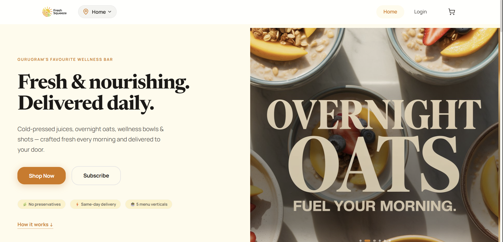
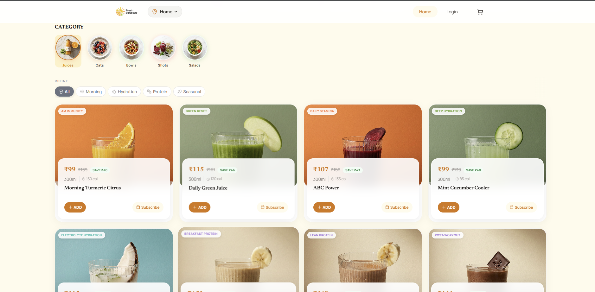

# Fresh Squeeze 🍊

A full-stack juice subscription and on-demand ordering app built for a premium juice bar in Gurugram. Customers browse a multi-vertical catalog, subscribe to recurring delivery plans, pay via an in-app wallet, and track orders in real time. Operators manage the entire order pipeline — cart lock to delivery — through a custom admin panel.

**Live → [freshsqueeze.in](https://www.freshsqueeze.in)**

> Source code is private (production business app). This repo documents the architecture and design decisions.

---



---

## Tech Stack

| Layer | Technology |
|---|---|
| Frontend | React 18, Vite 6, React Router 7 |
| Styling | Custom CSS design system — CSS custom properties, glass morphism, dark mode |
| Animation | Framer Motion |
| Backend | Supabase — PostgreSQL, Auth, Storage, Realtime, Edge Functions |
| Auth | Supabase Phone OTP via Twilio |
| Payments | Razorpay (wallet top-up via serverless Edge Functions) |
| Maps | MapMyIndia (Mappls) + Leaflet |
| Push notifications | Web Push API (VAPID) via service worker |
| Analytics | PostHog, Meta Pixel + Conversions API, Vercel Analytics |
| Error tracking | Sentry |
| Mobile | Capacitor 6 (Android) |
| Hosting | Vercel (production), Render (staging) |

---

## Architecture

### State management — 5 single-responsibility contexts

| Context | Owns |
|---|---|
| `AuthContext` | Supabase Phone OTP session, role checks (customer / admin / chef / rider) |
| `AppContext` | Juice catalog, subscriptions, orders, admin operations |
| `CartContext` | Daily cart items, 10 PM IST cutoff logic, localStorage sync |
| `WalletContext` | Wallet balance, transaction history, Realtime subscription |
| `LocationContext` | Geolocation, Mappls reverse geocoding, 5 km delivery zone check |

### Order pipeline — fully automated via pg_cron

```
Customer adds to cart (any time before 10 PM IST)
    ↓
10:00 PM IST — lock_daily_carts() runs
    → Carts frozen; no further edits
    ↓
11:00 PM IST — process_daily_orders() runs
    → Wallet balances checked and deducted
    → juice_orders rows created
    → Push notification sent to customer
    ↓
Next day — admin advances status:
    confirmed → preparing → out for delivery → delivered
```

The 10 PM cutoff is enforced in two places: `CartContext` (live countdown UI) and the database cron — both must agree on IST timezone offset to avoid race conditions.

### Payment flow — wallet-first architecture

Razorpay is used only for wallet top-ups, not direct order payment. This decouples payment failures from order placement:

```
Client → create-razorpay-order (Edge Function)
    → Razorpay checkout modal
    → verify-razorpay-payment (Edge Function)
        → HMAC-SHA256 signature verification
        → Idempotent RPC: credit_wallet()
    → WalletContext reloads balance via Supabase Realtime
```

A Razorpay outage blocks top-ups but never prevents a customer from placing an order against existing balance.

### Edge Functions — 9 deployed Deno/TypeScript functions

| Function | Purpose |
|---|---|
| `create-razorpay-order` | Creates order on Razorpay, returns ID to client |
| `verify-razorpay-payment` | Verifies HMAC signature, credits wallet idempotently |
| `mappls-token` | Proxies MapMyIndia credentials — never exposed client-side |
| `send-order-push` | Fires Web Push notification for order status changes |
| `get-user-by-phone` | Admin: look up a customer by phone number |
| `notify-cron-failure` | Alerts via Telegram if pg_cron jobs fail silently |
| `meta-track-event` | Server-side Meta Conversions API event forwarding |
| `meta-insights` | Fetches Meta Ads metrics for the admin panel |
| `list-users` | Admin: paginated user list with wallet balances |

### Access control — 4 roles, enforced at DB level

- **Customer** — standard app access
- **Admin** — full order pipeline and wallet management
- **Chef** — staff view scoped to kitchen operations
- **Rider** — staff view scoped to delivery operations

Role checks in the frontend are a UX convenience. The real security boundary is Row Level Security in PostgreSQL — every table has RLS policies enforced by `auth.uid()` and `user_metadata.role`.

### Membership — Fresh Squeeze Club (₹149/month)

Auto-activates after a customer's first delivery:

1. Backend sets `membership_status = 'trial'`, `trial_ends_at = now() + 30 days`
2. WhatsApp notification sent via Twilio
3. Every cart shows "Delivery ₹35 → ₹0 (Club member)" — customers see savings accumulate per order
4. Day 25: push notification with personalised savings total
5. Day 30: if not renewed, delivery fee reinstates automatically on next order

---

## Screenshots

| | |
|---|---|
|  |  |
| *Landing page* | *Juice catalog with category filters* |
|  |  |
| *Daily cart with 10 PM cutoff countdown* | *Founding member offer page* |

---

## Features

### Customer
- Phone OTP login — no passwords, Twilio SMS verification
- Multi-vertical catalog — juices, oats bowls, shots, salads with ingredient detail sheets
- Daily cart that auto-locks at 10 PM IST with live countdown
- Subscriptions — recurring daily or weekly delivery plans
- In-app wallet — top up via Razorpay; real-time balance; full transaction history
- Fresh Squeeze Club membership — free delivery + 10% off every order
- Referral program — unique referral links; ₹200 wallet bonus on redemption
- Support chat — keyword bot with escalation to human; Telegram notification to operator
- Push notifications — order status updates via Web Push API
- Dark mode — system-aware with manual toggle
- PWA — installable on desktop and mobile
- Android app — Capacitor 6 native wrapper

### Admin & Staff
- Order pipeline — advance status per order or in bulk
- Wallet management — credit wallets, view history per customer
- Promo codes — flat / bonus / percent with expiry and usage caps
- Referral leaderboard and redemption log
- Meta Ads dashboard — live campaign metrics (spend, ROAS, CTR, CPC)
- Support inbox — view and reply to tickets with real-time updates
- Hero carousel management — upload and reorder via Supabase Storage
- Scoped staff views for kitchen and rider roles
